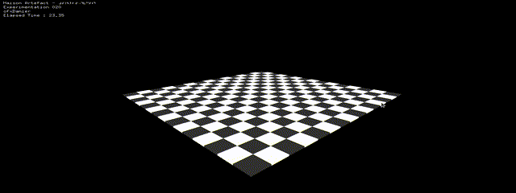

# ofxDamier

ofxDamier is a small addon for openframeworks who primarly use the ofBoxPrimitive to create a *damier* floor. You can customize :
-The number of tile per side
-Lenght of the tiles
-Tickness of the tiles
-The color of the tiles
-The texture of the tiles

## How to use
```C++

// In ofApp.h
// Declare the object
ofxDamier damier;


// In the setup section of ofApp.cpp
// Create/Setup the damier floor
damier.creation(int box_nbr, int box_hight, int box_tick, ofColor color1, ofColor color2);

// In the draw section of ofApp.cpp
// Simply draw it
damier.draw();


```

