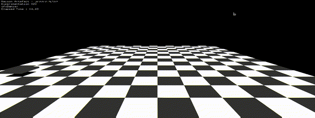

# ofxDamier

ofxDamier is a small addon for openframeworks who primarly use the ofBoxPrimitive to create a *damier* floor.  
You can customize :  
* The number of tile per side  
* Lenght of the tiles  
* Tickness of the tiles  
* The color of the tiles  
* The texture of the tiles  

## Installation

Install openframeworks if you don't allready have it and then put all the file in a folder name ofxDamier and put that folder in the addons folder of openframeworks.

## How to use

Include de addon in the ofApp.h file
```C++
#include "ofxDamier.h"
```
Add it to the addons.make file
```make
ofxDamier
```

### Basic Damier
```C++

// In ofApp.h
// Declare the object
ofxDamier damier;

// In the setup section of ofApp.cpp
// Create/Setup the damier floor
damier.creation(int box_nbr, int box_hight, int box_tick, ofColor color1, ofColor color2);

// In the draw section of ofApp.cpp
// Simply draw it
damier.draw();
```
<p align="center">
  
</p>

## Other Methods  
### Textured Damier
```C++

// In ofApp.h
// Declare the object
ofxDamier damier;


// In the setup section of ofApp.cpp
// Create/Setup the damier floor
damier.creation(int box_nbr, int box_hight, int box_tick, ofColor color1, ofColor color2);
damier.set_texture("path/to/image1.png", "path/to/image2.png");

// In the draw section of ofApp.cpp
// Simply draw it with text
damier.draw_texture();
```
<p align="center">
  
</p>

### Freeze Tile FX
```C++
// In the draw section of ofApp.cpp
// Use the freezeFX method before drawing
damier.freezfx();
damier.draw();
```
<p align="center">
  
</p>
